# Smart Parking with Automatic Number Plate Recognition

Bachelor of Engineering final-year group project that explored a smart parking prototype using computer vision, optical character recognition (OCR), and a simple parking-booking interface.

> **Repository status:** This repository is a reconstruction from the preserved 2021 final project report. The original development folder is no longer available. The ANPR and IP-camera code in `src/` was reconstructed from the report appendix and reorganized for readability. The screenshots in `docs/screenshots/` were extracted from the original report.

## Project Overview

The system was designed to reduce manual interaction at parking entrances by identifying a vehicle through its registration plate.

The documented workflow was:

1. Capture a vehicle image.
2. Preprocess the image.
3. Localize the number plate.
4. Extract the registration text using OCR.
5. Compare the detected registration number with stored records.
6. Grant access if the vehicle is registered; otherwise request registration.

The project report also documented a booking interface with registration, login, parking-slot selection, check-in/check-out timing, and booking-detail screens.

## System Workflow

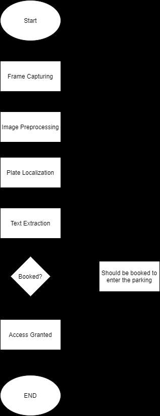

## ANPR Pipeline

The original implementation described the following image-processing stages:

- Grayscale conversion
- Bilateral filtering / noise reduction
- Canny edge detection
- Contour detection
- Four-corner plate-region approximation
- Plate masking/localization
- OCR with Pytesseract
- Registration-number comparison

### Example preprocessing

| Grayscale | Binarization / Filtering | Edge Detection |
|---|---|---|
| 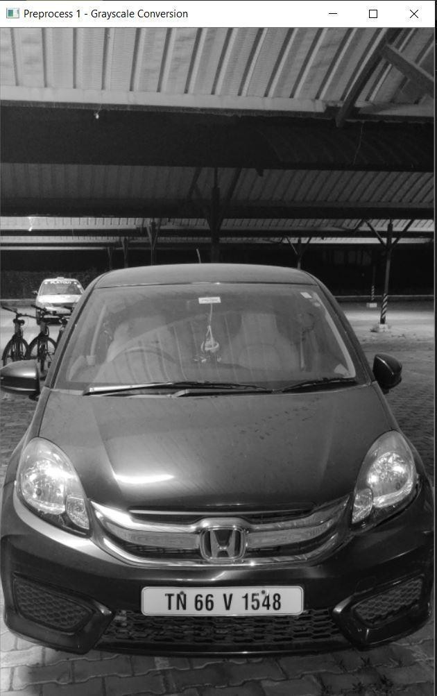 | 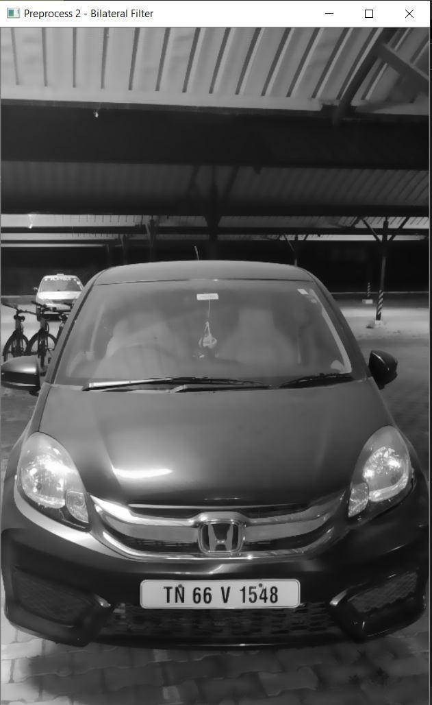 | 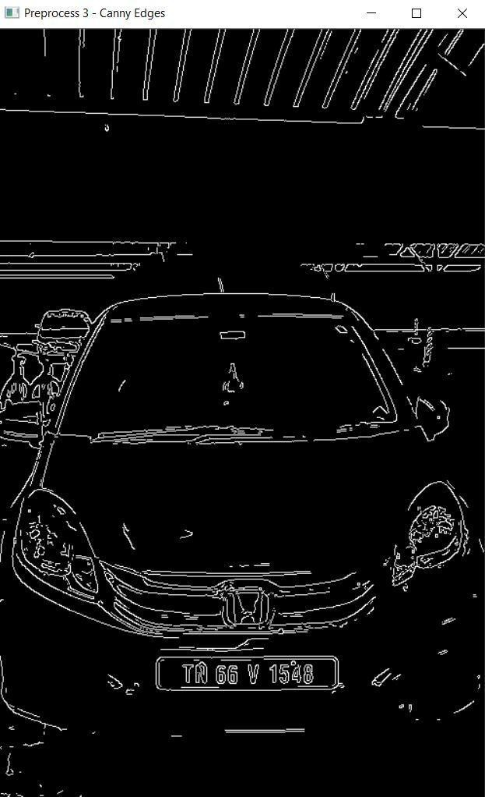 |

### Plate localization

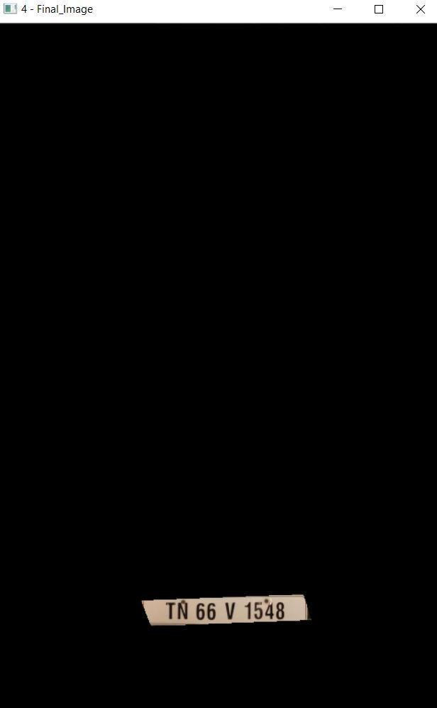

## Booking Interface

| Registration | Login |
|---|---|
| 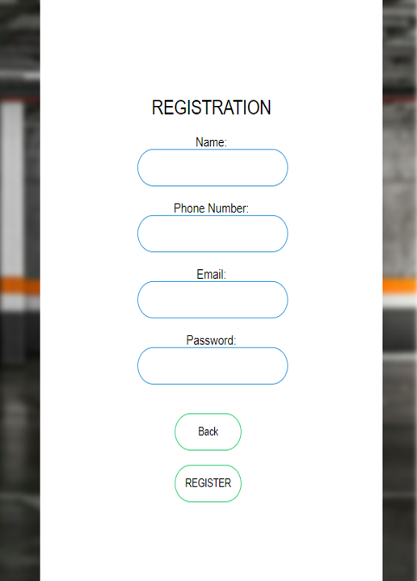 | 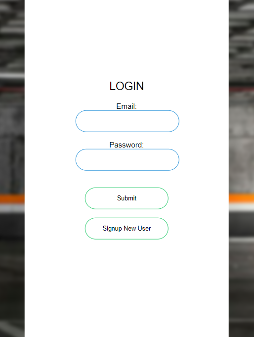 |

### Parking-slot interface

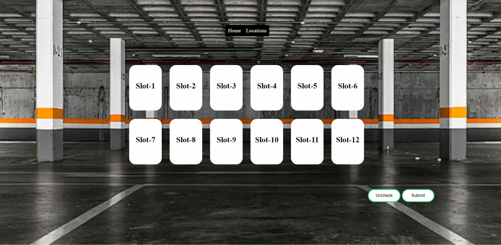

## Example Outputs

| Registered vehicle | System output |
|---|---|
| 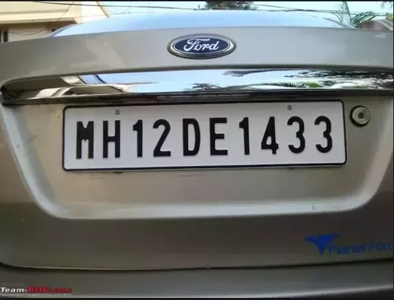 | 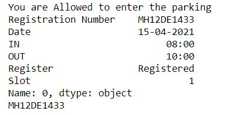 |

| Unregistered vehicle | System output |
|---|---|
| 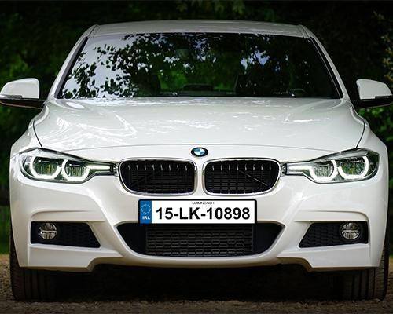 | 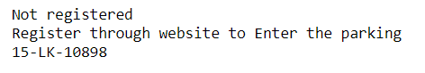 |

## Technologies Documented in the Original Project

- Python 3.6
- OpenCV
- Pytesseract / Tesseract OCR
- Pandas
- NumPy
- Imutils
- Flask
- HTML / CSS
- MongoDB Compass
- Raspberry Pi
- Raspberry Pi Camera
- Jupyter Notebook
- Visual Studio Code

## Repository Structure

```text
Bachelor-Project-Smart-Parking-Reconstructed/
├── README.md
├── requirements.txt
├── .gitignore
├── src/
│   ├── anpr.py
│   └── ip_camera.py
├── docs/
│   └── screenshots/
│       ├── workflow.png
│       ├── grayscale.jpg
│       ├── binarization.jpg
│       ├── edge_detection.jpg
│       ├── plate_localization.jpg
│       ├── registration.png
│       ├── login.png
│       ├── parking_slots.jpg
│       ├── registered_vehicle.jpg
│       ├── registered_output.png
│       ├── unregistered_vehicle.jpg
│       └── unregistered_output.png
└── paper/
    └── README.md
```

## Reconstructed ANPR Script

`src/anpr.py` follows the logic preserved in the original project appendix:

```bash
python src/anpr.py path/to/vehicle.jpg
```

Optional arguments allow the Tesseract executable path and a registration CSV file to be supplied.

Example:

```bash
python src/anpr.py vehicle.jpg \
  --tesseract "C:/Program Files/Tesseract-OCR/tesseract.exe" \
  --registrations registrations.csv
```

The script:

1. Loads and resizes the image.
2. Converts it to grayscale.
3. Applies bilateral filtering.
4. Runs Canny edge detection.
5. Finds high-area contours.
6. Searches for a four-corner contour as the likely plate.
7. Masks the plate region.
8. Runs Pytesseract OCR.
9. Optionally compares the extracted text with a CSV column named `Registration Number`.

## IP-Camera Prototype

The original appendix also contained a small OpenCV script that read frames from an IP Webcam URL. A cleaned reconstruction is available in `src/ip_camera.py`.

```bash
python src/ip_camera.py http://192.168.43.61:8080/
```

The actual address depends on the camera/device configuration.

## Important Limitations

- The original complete source-code folder was not preserved.
- The report appendix contains the ANPR and IP-camera portions, but not the complete Flask/MongoDB booking application source.
- The current code is therefore a **report-based reconstruction**, not a claim that the complete 2021 application has been recovered.
- The original implementation used Windows-specific paths and older library versions; the reconstructed scripts replace hard-coded paths with command-line arguments.
- No new accuracy, throughput, or performance claims are added because the preserved report does not provide a reproducible benchmark supporting them.

## Project Context

**Project:** Smart Parking  
**Program:** Bachelor of Engineering in Computer Science and Engineering  
**Institution:** Kumaraguru College of Technology, Coimbatore  
**Year:** 2021  
**Supervisor:** Dr. Baskaran K R

### Project Team

- Meeran Mydeen S
- Ezhilan C
- Annamalai R

## Source

This repository was reconstructed from the group's preserved final project report submitted in May 2021.
